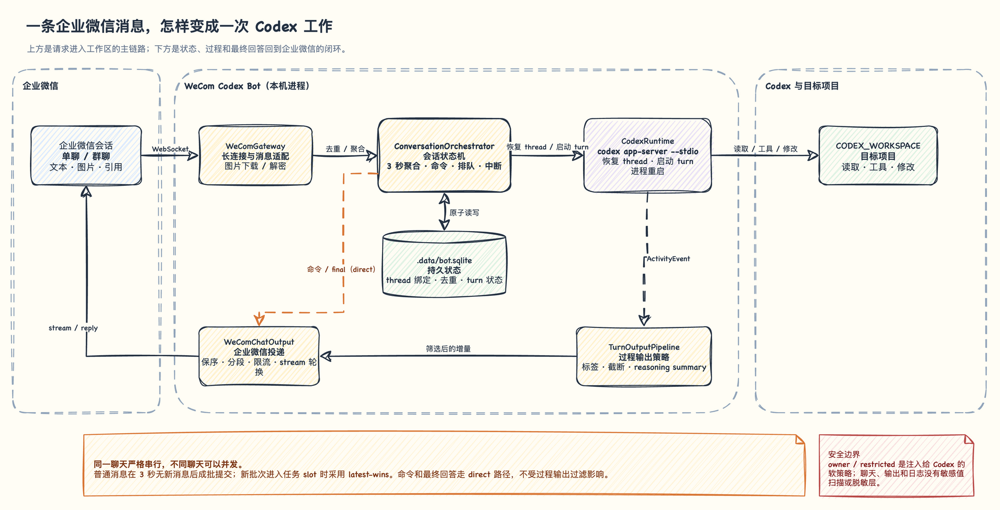

# 架构说明

WeCom Codex Bot 是企业微信与 Codex App Server
之间的本地桥接层。它负责聊天路由、thread
绑定、请求编排、状态恢复和输出投递；代码理解、工具调用和工作区操作由 Codex
完成。



[查看可编辑的 draw.io 源图](architecture/wecom-codex-message-flow.drawio)

## 组件职责

| 组件                       | 职责                                                              |
| -------------------------- | ----------------------------------------------------------------- |
| `WeComGateway`             | 维护企业微信长连接，规范化单聊/群聊消息，下载并解密图片，发送回复 |
| `ConversationOrchestrator` | 处理去重、防抖、命令、thread 绑定、排队、中断和 turn 生命周期     |
| `StateStore`               | 用 SQLite 保存 conversation/thread 绑定、消息去重和 turn 状态     |
| `CodexRuntime`             | 管理 App Server generation、thread 恢复、turn 启动和进程重启      |
| `CodexAppServerClient`     | 通过 stdio 发送 JSON-RPC 请求并接收通知                           |
| `TurnOutputPipeline`       | 根据标签与输出级别筛选、截断和格式化活动事件                      |
| `WeComChatOutput`          | 串行发送企业微信消息，维护流式回复、限流和关键帧额度              |
| `BotLifecycle`             | 固定服务启动、恢复与关闭顺序                                      |

`main.ts` 只负责读取配置、组装这些组件、安装信号处理和配置日志 transport。

## 一次普通消息的生命周期

1. `WeComGateway` 把企业微信 frame 转成统一消息，并为单聊或群聊生成 conversation
   key。
2. `ConversationOrchestrator` 先按 `msgid` 去重，再把同一 conversation 在 3
   秒窗口内到达的文本与图片按顺序聚合。
3. 批次到期后，编排器读取 SQLite 中的绑定。已有 thread 会先
   resume；没有绑定时调用 `thread/start` 并保存新 thread ID。
4. 图片被下载到当前进程专属的临时目录，并以 App Server `localImage` 输入加入
   turn。
5. `CodexRuntime` 调用 `turn/start`。Codex 在 `CODEX_WORKSPACE`
   中读取项目指令、调用工具并执行工作。
6. App Server 通知先转换成 `ActivityEvent`，再由本 turn 的 `TurnOutputPipeline`
   按配置生成企业微信进度。
7. turn 结束后，最终回答绕过过程事件过滤直接发送；SQLite
   更新终态，临时图片随请求释放。

斜杠命令走本地控制路径，不进入上述 turn
流程。`/help`、`/status`、`/model`、`/effort`、`/new`、`/stop`
和未知命令都不会成为 Codex prompt。

## conversation、thread 与 turn

```text
企业微信 conversation  1 ─── 1  Codex thread
Codex thread           1 ─── N  Codex turn
```

- 单聊使用用户 ID 建立 conversation key，群聊使用群 ID。
- 每个 conversation 拥有独立的消息窗口、pending 请求和活动 turn。
- 同一 conversation 的 turn 严格串行，不同 conversation 可以并发。
- `/new` 取消尚未提交的消息批次并创建新 thread；它本身不启动 turn。
- `/stop` 清除当前 conversation 的等待任务并中断活动 turn，同时保留 thread
  绑定。

### 消息聚合与 latest-wins

普通文本、独立图片、mixed 消息，以及引用消息中识别出的图片共享同一个 3 秒
trailing debounce。每条通过去重的新消息都会重置窗口，批次到期时才占用
conversation 的任务 slot。

批次到期后采用 latest-wins：

- 活动 turn 存在时，新批次会请求中断它。
- 普通 pending 已存在时，只保留最后一个到期批次。
- 等待聚合的消息不会提前打断活动 turn。

群聊成员共享群 conversation 的窗口。每条消息自己的 sender、`msgid`
和引用信息仍会保留，整个批次使用最后一条消息的企业微信 frame
承载进度和最终回复。

## Codex 运行时

机器人为每个进程维护一个 `codex app-server --stdio` 子进程，并通过
JSONL/JSON-RPC 与它通信。Codex
登录、模型、沙盒、审批、网络和项目指令继续遵循用户已有配置；机器人主要传入工作目录、输入与应用级上下文。

App Server 意外退出时，`CodexRuntime` 会创建新的 runtime
generation，并按递增间隔尝试恢复。持久 thread 在新 generation 中重新 resume；旧
generation 的晚到事件不会进入新的 turn。进程丢失时，活动 turn 会以
`runtime_lost` 结束。

App Server 的交互式 `requestUserInput`
当前采用明确的中断语义：机器人把问题直接发到企业微信，向 App Server
返回空答案并中断当前 turn。用户的下一条消息会启动新
turn，而不是继续原来的进程内等待。

## 输出链路

Codex 通知先保留原始活动语义，再进入显示策略。这样事件适配与展示配置保持分离：

```text
App Server notification
  -> CodexRuntime
  -> ActivityEvent
  -> ConversationOrchestrator
  -> TurnOutputPipeline
  -> WeComChatOutput
```

过程事件可以按
`QUEUE`、`TURN`、`TOOL`、`TOOL_RESULT`、`CONTENT`、`PLAN`、`WARNING`、`ERROR`、`SHUTDOWN`
和 `SUBAGENT` 分别控制。最终回答、命令回复、直接错误与用户输入请求使用 direct
投递，始终可见。

企业微信发送在每个 conversation
内保序。输出层为最终回复和流关闭保留关键发送额度，并在长时间流式输出时轮换
stream。完整配置见[配置参考](configuration.md)。

## 持久化与临时数据

`.data/bot.sqlite` 使用同步 `node:sqlite` API，目前保存：

- conversation key 与 Codex thread ID 的绑定
- 已处理 `msgid` 的去重记录
- 活动 turn ID、状态和必要的恢复字段

数据库不保存聊天正文、prompt、Codex 输出和图片字节。Schema 通过
`PRAGMA user_version` 进行版本迁移。

图片写入 Linux 当前进程专属的 `/tmp/wecom-codex-bot-*`
随机目录。请求终止后删除对应文件，正常关闭时清理整个进程目录。

## 启动与关闭

启动顺序：

```text
打开 SQLite
  -> 标记上次遗留的活动 turn 为 runtime_lost
  -> 创建图片临时目录
  -> 启动 Codex App Server
  -> 连接企业微信
```

收到 `SIGINT` 或 `SIGTERM` 后，关闭顺序为：

```text
停止接收新工作并中断 turn
  -> 停止常规输出
  -> 完成活动 stream
  -> 断开企业微信
  -> 关闭 Codex App Server
  -> 清理图片并关闭 SQLite
```

每一步都有独立清理边界，一项失败不会跳过后续资源释放。尚未到期的消息批次在关闭时直接丢弃。

## 代码地图

| 文件                      | 主要职责                                 |
| ------------------------- | ---------------------------------------- |
| `main.ts`                 | 依赖组装、日志和进程信号                 |
| `src/config.ts`           | 环境变量与工作目录解析                   |
| `src/wecom.ts`            | 企业微信 SDK 适配与消息规范化            |
| `src/orchestrator.ts`     | conversation 状态机与用户命令            |
| `src/state.ts`            | SQLite 状态与迁移                        |
| `src/codex-app-server.ts` | App Server 子进程和 JSON-RPC             |
| `src/codex-runtime.ts`    | runtime generation、thread 与 turn       |
| `src/codex-events.ts`     | App Server 通知到 `ActivityEvent` 的转换 |
| `src/output-pipeline.ts`  | 输出筛选、截断、标签和摘要尾块           |
| `src/output.ts`           | UTF-8 分段、发送限流和 stream 轮换       |
| `src/chat-output.ts`      | 企业微信输出适配                         |
| `src/lifecycle.ts`        | 服务启动、恢复和优雅关闭                 |
| `src/owner-policy.ts`     | owner 识别与隔离 instructions            |
| `src/prompt.ts`           | 聊天与发送者元数据的 prompt 封装         |

测试与实现共置为
`src/*.test.ts`。并发与失败语义通常由同名测试给出最完整的可执行契约。
